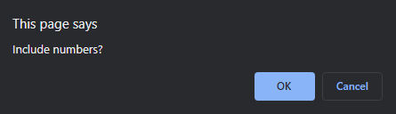

# Password Generator utilizing JavaScript - Justin Asari

## Table of Contents
1. About the Project
2. Difficulties
3. Update Log
4. Screenshots

## About the Project
The password generator allows a user to generate password between 8 and 128 characters using a variety of character types including uppercase, lowercase, numbers, and symbols. 

Once the "Generate Button" is pressed, the user is prompted for the length of the password. Once the length is confirmed, each character type is then prompted to the user, which can either be confirmed or cancelled. The script targets the character type function once it is confirmed to be selected by the user. Once every prompt is completed, the password is then generated with the selected variables.

The character type generator functions in the JavaScript utilizes functions rather than arrays. The character set values were taken from http://net-comber.com/charset.html. The functions generates a decimal number that is then rounded down. It is then multiplied to the amount of characters included in the specific function (Alphabet has 26 values (A-Z) and numbers have 10 values (0-9)). Then the last number is added to correctly choose the right character set range.

## Difficulties
1. The only difficulty was retrieving the right character codes and utlizing the Math object to get the specific characters. I looked up how to target character codes using the Math object and found out that I needed to include .fromCharCode to be able to tell the function I was retrieving data from the specific character set. The Rock, Paper, Scissors game done during class helped with creating the prompts and user selection. 

## Update Log
1. Password Generator pushed to Github - January 10, 2021

## Screenshots

